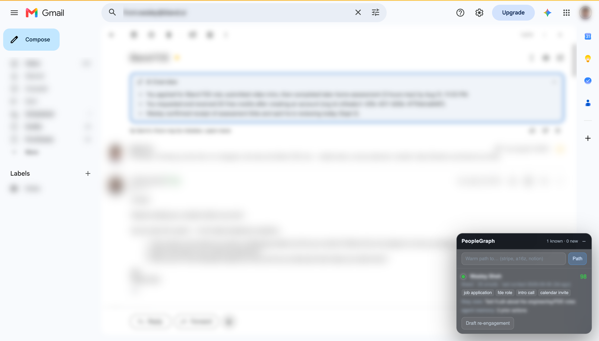
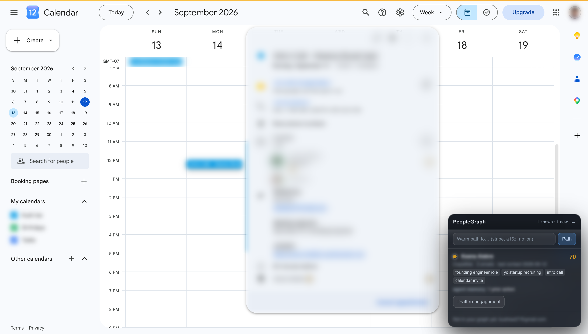
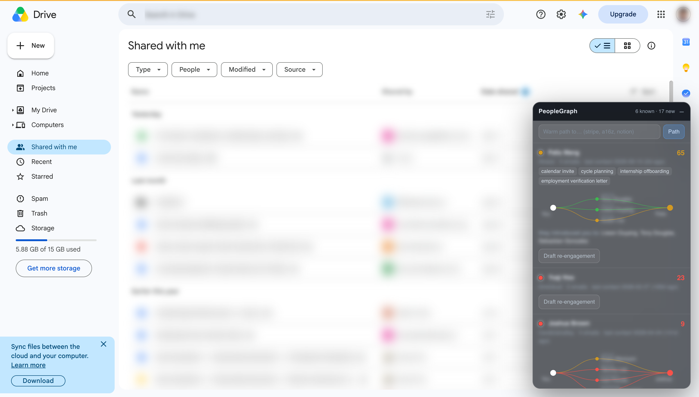
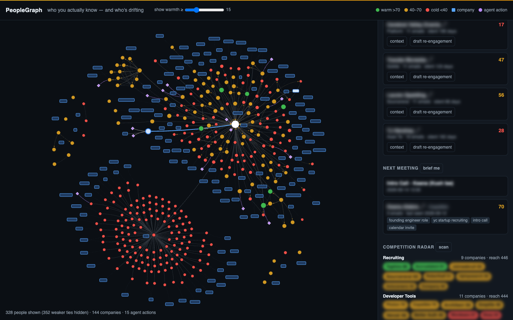
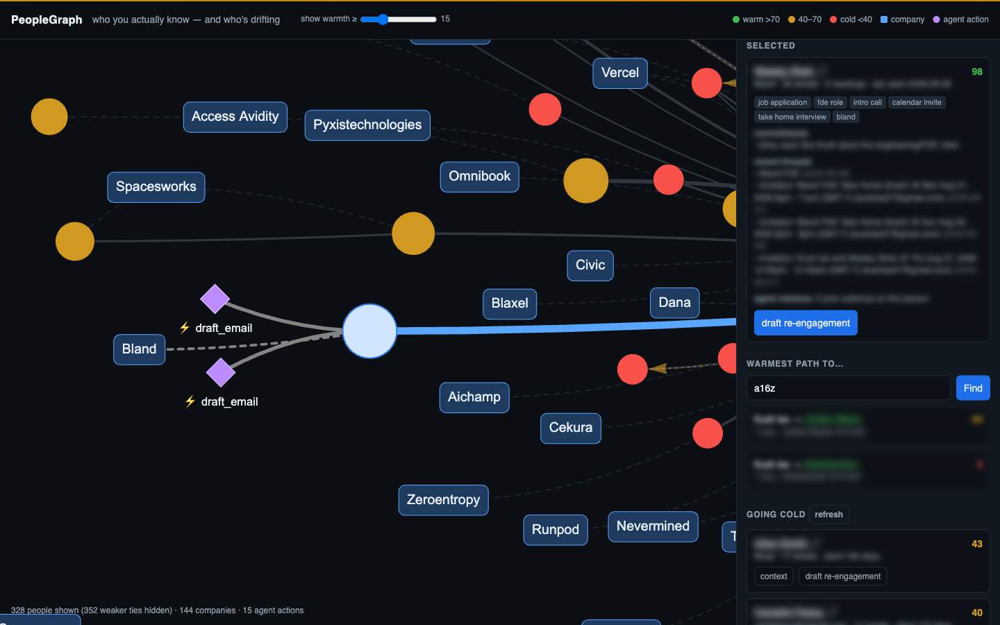
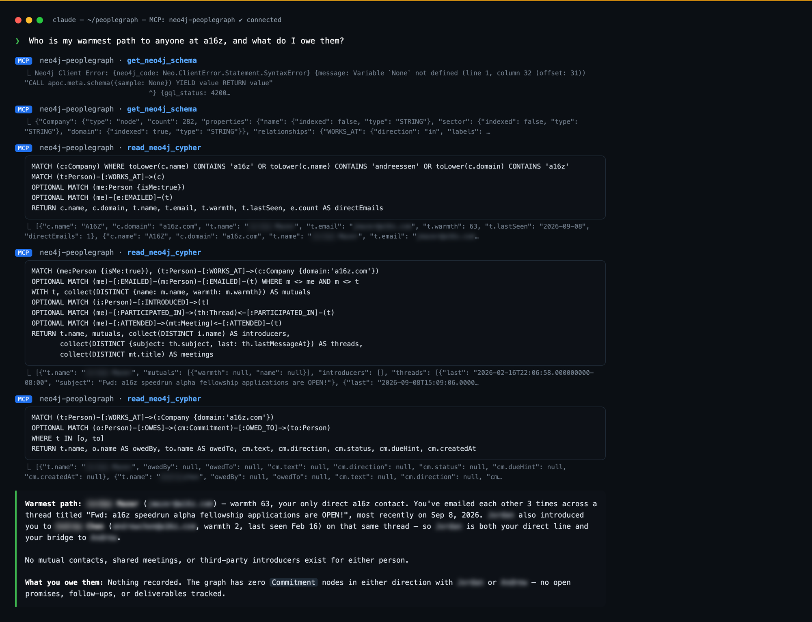
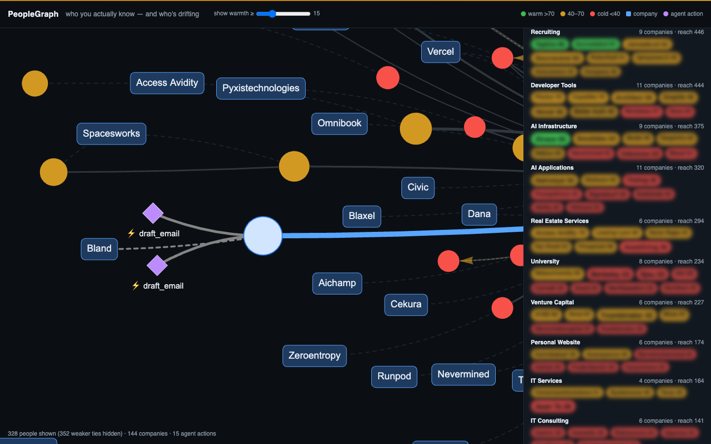
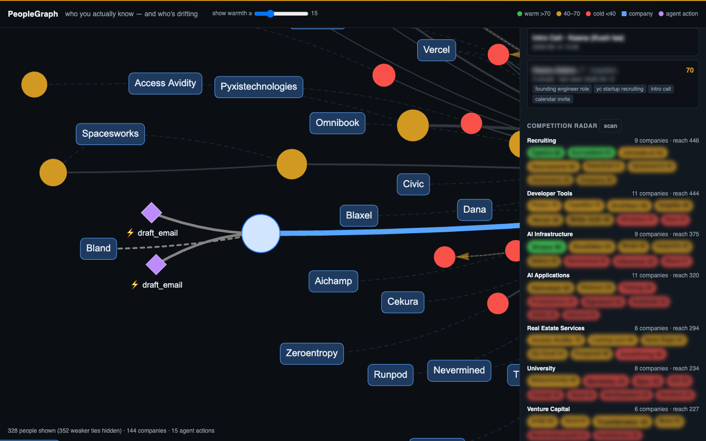

# PeopleGraph

**LinkedIn shows who you're connected to. PeopleGraph shows who you actually know — and works for you inside the tools where relationships happen.**

PeopleGraph reads your Gmail and Google Calendar, builds a living relationship graph in **Neo4j Aura**, and answers the three questions a CRM never can:

- **"Who's my warmest path to company X?"** — shortest path over *who actually emails whom*, scored by relationship warmth.
- **"Which relationships are going cold?"** — real history, silent lately — with a one-click, graph-grounded re-engagement draft.
- **"Brief me before my next meeting."** — per attendee: history, shared topics, open commitments, who introduced you.

It ships as a **Chrome extension** that overlays the graph on Gmail, Calendar, Drive, Docs, Contacts, Meet and Chat, a **web console** for the full network, a **competition radar**, and a **Neo4j MCP server** so any agent can query the graph in natural language. Every draft, brief and query the agent produces is written *back* into the graph as an `AgentAction` node. **The graph is the agent's memory.**

> All screenshots below are from a real inbox (1,462 emails, 60 meetings, 680 people). Names, addresses and message bodies are blurred.

---

## Table of contents

1. [What it looks like](#what-it-looks-like)
2. [Architecture](#architecture)
3. [Quickstart](#quickstart)
4. [Getting real data in (Gmail + Calendar)](#getting-real-data-in)
5. [The Chrome extension](#the-chrome-extension)
6. [The web console](#the-web-console)
7. [Data model](#data-model)
8. [Warmth score](#warmth-score)
9. [The three queries](#the-three-queries)
10. [Agent memory & GraphRAG drafts](#agent-memory--graphrag-drafts)
11. [Competition radar](#competition-radar)
12. [Neo4j MCP: natural-language queries](#neo4j-mcp-natural-language-queries)
13. [API reference](#api-reference)
14. [Synthetic data](#synthetic-data)
15. [Project layout](#project-layout)
16. [Privacy](#privacy)

---

## What it looks like

### Gmail — the overlay follows the thread you're reading

Open any email. The glass panel shows every person on the thread: **warmth score**, company, email count, last contact, LLM-extracted **topics**, what **you owe them / they owe you**, who **introduced** you, and how many prior **agent actions** exist for them. Names get an inline warmth dot. Contacts silent 45+ days get a *going cold* alert and a **Draft re-engagement** button.



### Calendar — every attendee briefed before you join

Click an event: attendees are looked up in the graph. Here the upcoming intro call shows the attendee's warmth, the topics you've discussed ("founding engineer role", "yc startup recruiting") and that the agent already has one prior action on file for them.



### Drive — who's sharing with you, and how you're connected

On *Shared with me*, every file owner becomes a card with a **connection tree**: *You ─ (introducer / mutual contact / colleague) ─ Them*, coloured by the warmth of each hop. Same panel appears in Docs share dialogs, Contacts, Meet's People panel and Chat spaces.



### The web console — your whole network as a graph

You are the white node. People are coloured by warmth (green > 70, amber 40–70, red < 40), sized by warmth; companies are blue boxes; the purple diamonds are `AgentAction` nodes the agent wrote back. Dashed amber arrows are **detected introductions**. The **warmth ≥** slider hides weak ties.



Click a person: the *Selected* panel shows their context (topics, commitments, mutuals, recent threads, agent memory). Click a company: the **warmest path** into it. Here: two `draft_email` actions hang off the selected contact, and the path search found a 1-hop route into a16z.



### Claude Code + Neo4j MCP — ask the graph in plain English

No PeopleGraph code involved here: Claude Code talks to Aura directly through the official Neo4j MCP server. Asked *"Who is my warmest path to anyone at a16z, and what do I owe them?"*, it introspected the schema, wrote three Cypher queries on its own (warm path, shared context, open commitments) and answered from the live graph — including an introduction it found on the `INTRODUCED` edges.



### Competition radar — where you actually have reach

Every company in your network, sector-tagged by the LLM, ranked by your reach (people you know × warmth). Bubble size = people, colour = warmest contact. Click a bubble to get the warm path.



### Going cold + pre-meeting brief



---

## Architecture

```
Gmail + Calendar APIs (read-only OAuth)           Google Takeout (mbox + ics)
            └──────────────┬──────────────────────────────┘
                           ▼
              scripts/fetch_google.py  →  data/inbox.mbox + data/calendar.ics
                           ▼
              peoplegraph/ingest.py  (pure Python aggregation)
                • people, companies (from domains), threads, meetings
                • EMAILED edges aggregated per ordered pair
                • introduction detection
                • LLM extraction: topics + commitments (50 most recent threads, batched)
                • warmth pass (Cypher)
                           ▼
                    Neo4j Aura Free
          ┌────────────────┼──────────────────────┐
          ▼                ▼                       ▼
   FastAPI (:8010)   Neo4j MCP server        Aura Query / Bloom
   ├─ /graph /path   (Claude Code, Qoder,
   │  /cold /brief    Claude Desktop)
   │  /draft /radar
   ├─ web console (vis-network)
   └─ Chrome extension overlay (Gmail, Calendar, Drive, Docs, Contacts, Meet, Chat)
```

**LLM use is deliberately minimal** (Anthropic Claude via the official SDK, structured outputs):

1. topic + commitment extraction at ingest,
2. the re-engagement draft,
3. sector tagging for the radar.

Warmth, warm paths, cold detection, briefs and connection trees are **pure Cypher**. Everything degrades gracefully without an API key (regex extraction, template drafts).

**Stack:** Python 3.12, FastAPI, `neo4j` driver, stdlib `mailbox`, `icalendar`, `google-api-python-client`, `anthropic`, vis-network (CDN), Manifest V3 extension (no build step anywhere).

---

## Quickstart

```bash
git clone https://github.com/Kush614/peoplegraph && cd peoplegraph
uv venv -p 3.12 .venv && uv pip install -p .venv/bin/python -r requirements.txt
cp .env.example .env
```

**Neo4j Aura Free** — console or CLI:

```bash
# CLI (https://github.com/neo4j/aura-cli): credential from Aura console → API keys
aura credential add --name pg --client-id … --client-secret …
aura instance create --name peoplegraph --type free-db --await --output json
# → connection_url, username, password → paste into .env
```
> Aura Free names the database after the instance id (e.g. `c071d13f`), **not** `neo4j`. Leave `NEO4J_DATABASE` blank to use the server default.

**Run with synthetic data** (no Google setup needed — a seeded, story-shaped inbox):

```bash
.venv/bin/python scripts/generate_synthetic.py       # 325 emails, 24 meetings, 39 people, 8 companies
.venv/bin/python -m peoplegraph.ingest --dry-run     # parse + aggregate, no DB
.venv/bin/python -m peoplegraph.ingest --reset       # ingest into Aura (~10 s)
.venv/bin/uvicorn peoplegraph.app:app --port 8010    # http://127.0.0.1:8010
```

---

## Getting real data in

`scripts/fetch_google.py` pulls mail and events through the Gmail and Calendar APIs with **read-only** scopes and writes the same `inbox.mbox` / `calendar.ics` the ingest already understands.

One-time (≈5 min): in Google Cloud console, enable **Gmail API** + **Google Calendar API**, configure the OAuth consent screen (External, add yourself as a test user), create an **OAuth client → Desktop app**, download the JSON to `data/credentials.json`. With `gcloud` you can script all but the client itself:

```bash
gcloud projects create peoplegraph-xyz && gcloud config set project peoplegraph-xyz
gcloud services enable gmail.googleapis.com calendar-json.googleapis.com
```

Then:

```bash
.venv/bin/python scripts/fetch_google.py --days 540 --limit 2000   # consent opens in the browser
.venv/bin/python -m peoplegraph.ingest --reset
```

Defaults: last 18 months, promotions/social/updates/forums excluded, calendar events with ≥ 2 attendees plus the next 30 days. Gmail rate-limits aggressively; the fetcher uses small batches with 429 back-off (≈1 msg/s). The owner address is recorded in `data/owner.txt`; automated senders (`noreply@`, `notifications@`, mailers) are dropped at ingest so they never become "people".

Takeout works too: drop `inbox.mbox` and `calendar.ics` into `data/` and set `MY_EMAIL`.

---

## The Chrome extension

`extension/` is a Manifest V3 extension with no build step.

**Install:** `chrome://extensions` → *Developer mode* → **Load unpacked** → select `extension/`. The popup lets you change the API base URL (default `http://127.0.0.1:8010`) and test the connection.

**What it does on each surface**

| Surface | Trigger | Panel shows |
|---|---|---|
| Gmail | open a thread, or compose recipients | cards for every participant; warmth dots inline on names; going-cold alert + draft |
| Calendar | click an event / edit page | every attendee briefed: warmth, topics, commitments, intros |
| Drive | *Shared with me*, Share dialog, *Manage access* | file owners / collaborators with connection trees |
| Docs | Share dialog, comment threads | collaborators before you hit Send |
| Contacts | open a contact | full relationship card |
| Meet | People panel | who just joined, with context |
| Chat | space / DM | member cards |

**How it works:** a content script watches the DOM (`span[email]` in Gmail, `data-hovercard-id` / `aria-label` / `title` in Calendar, Drive, Meet; a text scan as fallback), debounces, calls `GET /lookup?emails=…`, and renders a draggable glass panel. **Draft re-engagement** posts to `/draft/{email}`, shows the draft with its rationale and what it was grounded on, offers *Open in Gmail compose* / *Copy*, and the `AgentAction` appears in the graph immediately. The panel's search box runs the warm-path query from anywhere.

It runs in large iframes too (Drive's preview and Docs viewers live in frames). Content scripts are exempt from Google's page CSP, so the local API is reachable.

---

## The web console

`http://127.0.0.1:8010` — one HTML page, vis-network from CDN.

- **Canvas** — people (warmth colour/size), companies, introductions (dashed amber), agent actions (purple). Click a person → *Selected*; click a company → warm path.
- **show warmth ≥** — hide weak ties (real inboxes have ~1k people; the default floor of 15 keeps ~300).
- **Warmest path to…** — domain or name fragment (`stripe`, `a16z`).
- **Going cold** — with *context* and *draft re-engagement*; names deep-link to their threads in Gmail.
- **Next meeting → brief me**.
- **Competition radar → scan**.
- **Agent memory** — every `AgentAction`, newest first.

---

## Data model

| Node | Key | Properties |
|---|---|---|
| `Person` | `email` | `name, firstSeen, lastSeen, isMe, warmth (0–100)` |
| `Company` | `domain` | `name, sector` (inferred from non-freemail domains; sector from the radar) |
| `Meeting` | `id` | `title, start, end` |
| `Thread` | `id` | `subject, lastMessageAt, messageCount` — reply chain ∪ (normalised subject × same counterparties), split on 45-day silence |
| `Topic` | `name` | LLM extracted |
| `Commitment` | `id` | `text, direction (owed_by_me / owed_to_me), dueHint, status, sourceThreadId, createdAt` |
| `AgentAction` | `id` | `type (draft_email / brief / query), content, rationale, createdAt` |

| Relationship | Properties | Meaning |
|---|---|---|
| `(Person)-[:EMAILED]->(Person)` | `count, firstDate, lastDate` | directed, one edge per ordered pair, aggregated |
| `(Person)-[:ATTENDED]->(Meeting)` | | from calendar |
| `(Person)-[:WORKS_AT]->(Company)` | `inferredFrom` | from email domain |
| `(Person)-[:PARTICIPATED_IN]->(Thread)` | `messageCount` | |
| `(Thread)-[:ABOUT]->(Topic)` | | |
| `(Person)-[:INTRODUCED]->(Person)` | `viaThreadId, date` | A starts a thread with B and C who never co-occurred before |
| `(Commitment)-[:MADE_IN]->(Thread)` | | |
| `(Person)-[:OWES]->(Commitment)-[:OWED_TO]->(Person)` | | |
| `(AgentAction)-[:CONCERNS]->(Person)` | | agent memory |

Constraints and indexes: `cypher/schema.cypher`. All writes are `MERGE` on the key → re-running ingest is safe.

---

## Warmth score

`Person.warmth` (0–100), recomputed after every ingest in one Cypher pass (`cypher/warmth.cypher`, no APOC):

- **Recency (50)** — `50 − daysSinceLastContact/3`, full marks ≤ 2 weeks, zero at 5 months
- **Frequency (30)** — `min(30, emails × 1.5 + meetings × 5)`
- **Reciprocity (20)** — `20 × min(sent, received) / max(sent, received)`

---

## The three queries

All in `cypher/`, ready to paste into the Aura query editor.

**Q1 — warmest path to a company** (`q1_warm_path.cypher`)
`shortestPath((me)-[:EMAILED*..4]-(target))` for every person at the company, scored by the mean warmth of the hops; top 3.

**Q2 — going cold** (`q2_going_cold.cypher`)
`lastSeen < today − 45d AND emails ≥ 5`, ordered by history; includes open commitments they owe you.

**Q3 — pre-meeting brief** (`q3_meeting_brief.cypher`)
Next `Meeting` I attend → each attendee's warmth, email count, topics, what they owe / I owe.

---

## Agent memory & GraphRAG drafts

`POST /draft/{email}` gathers a **traversal bundle** around the person — recent shared threads, topics, commitments in both directions, mutual contacts ranked by warmth, meetings, **and every prior `AgentAction` on them** — and asks Claude for a short re-engagement email in the owner's voice plus a one-sentence rationale. The result is stored as `(AgentAction {type:'draft_email'})-[:CONCERNS]->(Person)`.

The same happens for briefs (`type:'brief'`) and warm-path queries (`type:'query'`). Next time the agent drafts for that person it reads those nodes first, so it doesn't repeat itself. *Our agent doesn't have a context-window problem — it has a knowledge graph.*

Example (real, names changed): for a VC contact silent 184 days after 17 emails, the draft referenced the hackathon thread they'd run, noted the two of them "traded eight messages and never actually talked", and proposed a call; rationale: *"substantial history across four threads but zero meetings — convert a text-only relationship into a real conversation while the context is fresh."*

---

## Competition radar

`GET /radar` groups every company in your network by **sector** (one LLM call per 60 domains, cached on `Company.sector`) and ranks them by **reach** = `0.6 × warmest contact + 0.2 × mean warmth + people bonus`. Answers "where do I actually have a way in?" — and, read the other way, which competitors and adjacent players you're already one hop from.

---

## Neo4j MCP: natural-language queries

**What MCP is, in one line:** a standard way for an AI assistant to call tools. The official `mcp-neo4j-cypher` server turns your Aura database into three tools — `get_neo4j_schema`, `read_neo4j_cypher`, `write_neo4j_cypher` — and any MCP client (Claude Code, Claude Desktop, Qoder, Cursor) can use them.

**How a question becomes an answer** (see the screenshot above):

1. You ask in English inside Claude Code: *"Who is my warmest path to anyone at a16z?"*
2. Claude calls `get_neo4j_schema` — it learns there are `Person`, `Company`, `Commitment`, `AgentAction` nodes and `EMAILED`, `WORKS_AT`, `INTRODUCED`, `OWES` relationships, with counts and property types.
3. It writes Cypher itself and runs it with `read_neo4j_cypher` — typically two or three queries: find people at the company, gather shared context (mutual contacts, introductions, threads, meetings), check open commitments.
4. It answers with the path, the evidence, and what's outstanding.

Nothing is hard-coded: the same session can ask *"who introduced me to whom this year?"*, *"which of my relationships at universities are going cold?"*, or *"what has the agent already done for <person>?"* (reads `AgentAction` nodes — the agent's memory is queryable by the agent). `write_neo4j_cypher` lets an agent record its own actions or mark a commitment done.

```bash
mcp/register.sh claude-code   # registers with Claude Code (reads .env)
mcp/register.sh               # prints a config block for Claude Desktop / Qoder
```
> Use `mcp-neo4j-cypher@0.6.0` on Python 3.12 (`uvx -p 3.12 …`); 0.4.1 is broken against current `fastmcp`.

Demo prompts (with verified answers) in `mcp/DEMO_PROMPTS.md`:
- *"Who is my warmest path to anyone at a16z?"*
- *"Which of my relationships are going cold? Show last contact and history."*
- *"Brief me before my next meeting."*
- *"What has the agent already done for <person>?"* — reads `AgentAction` nodes.
- *"Who introduced me to whom this year?"*

---

## API reference

| Route | What |
|---|---|
| `GET /graph?min_warmth=15` | nodes + edges for vis-network (people above the warmth floor, their companies, agent actions) |
| `GET /path?company=stripe` | Q1 — domain or name fragment; records a `query` action |
| `GET /cold` | Q2 |
| `GET /brief` | Q3 for the next meeting; records a `brief` action per attendee |
| `GET /lookup?emails=a,b,c` | batch cards for the extension: warmth, topics, commitments, intros, mutuals, colleagues |
| `GET /person/{email}` | the full GraphRAG context bundle |
| `POST /draft/{email}` | grounded re-engagement draft; records a `draft_email` action |
| `GET /radar` | competition radar (`?refresh=1` re-tags sectors) |
| `GET /companies` | companies with headcount |
| `GET /actions` | agent memory |
| `GET /health` | DB reachability |

CORS is enabled for Google origins so the extension can call the API directly.

---

## Synthetic data

`scripts/generate_synthetic.py` (seed 42, dates relative to *today*): 39 people across 8 companies (Stripe and Notion as targets), 5 strong reciprocal ties, 4 ties hot ~6 months ago and silent since, 3 planted introductions, 5 open commitments in recent threads, 24 meetings with 3 upcoming. Stripe is reachable only through intermediaries. Verified expectations for all three queries live in `mcp/DEMO_PROMPTS.md`.

---

## Project layout

```
peoplegraph/            FastAPI app, ingest, parsing, queries, LLM calls, static console
  app.py                routes
  ingest.py             mbox+ics → graph (CLI: --dry-run / --reset / --no-llm)
  parse.py              mailbox + icalendar parsing
  queries.py            Cypher used by the API
  llm.py                extraction, drafting, sector tagging (Anthropic SDK, structured outputs)
  static/index.html     web console
cypher/                 schema, warmth, Q1–Q3 (paste into Aura)
extension/              Chrome extension (MV3)
scripts/                generate_synthetic.py, fetch_google.py
mcp/                    MCP configs, register script, demo prompts
docs/img/               screenshots (sensitive info blurred)
```

---

## Privacy

Your mail never leaves your machine except to (a) your own Neo4j Aura instance and (b) the LLM API, which receives only subject lines + short body snippets of the 50 most recent threads at ingest, and the traversal bundle when you ask for a draft. The Google OAuth scopes are read-only. `.env`, `data/`, OAuth `credentials.json` / `token.json` are gitignored.

---

Built in one afternoon with Qoder and Claude Code for a Neo4j hackathon. Demo script: `mcp/DEMO_PROMPTS.md`.
